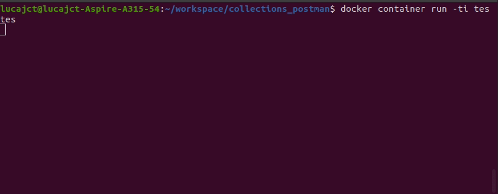

# Postman com Newman  

Os testes de APIs com o Postman é uma alternativa eficiente para automação. Com os recursos do Postman podemos executar testes através da linha de comando,após gerarmos as collections e utilizando o Newman. 
***  



### Dependências  

* [Postman](https://www.postman.com/downloads/ "Postman")  
* [Node](https://nodejs.org/en/ "Node")  

__Instalar Newman e Reports:__  
obs: com os reports, os relatórios são fornecidos em html no diretório do projeto.

* `npm install -g newman`  
* `npm i -g newman-reporter-htmlextra`  
* `npm i -g newman-reporter-html`

### Executar o Projeto pela linha de comando  
 __Newman com HTML Reporter__  

* `newman run -d data/data.csv postman_collection.json -e dev_environment.json --folder Leads -r html`   

 __Newman com HTML Extra__  

* `newman run -d data/data.csv postman_collection.json -e dev_environment.json --folder Leads -r htmlextra`    

***  
   
### Execute com Docker  
pré-requisito: ter o Docker instalado.  
```bash
* Fazer o build da imagem:

$ docker image build -t newman_test . 
```  

```bash
* Executar o container:  

$ docker container run -ti newman_test

``` 